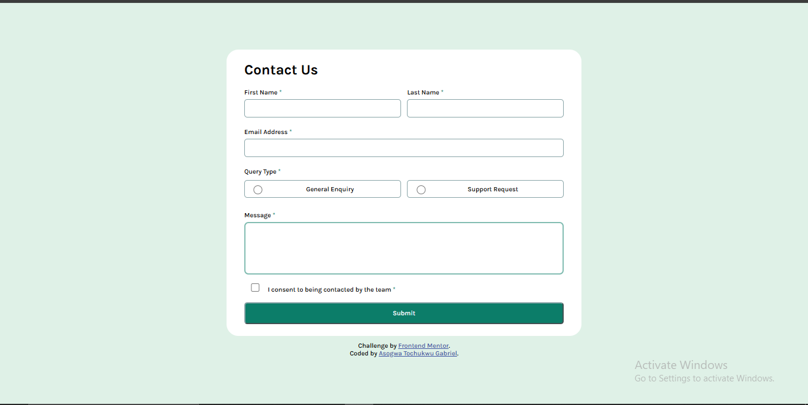
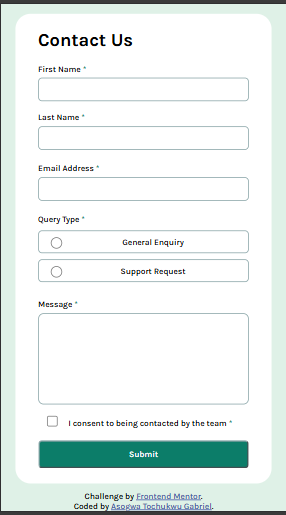

# Frontend Mentor - Contact form solution

This is a solution to the [Contact form challenge on Frontend Mentor](https://www.frontendmentor.io/challenges/contact-form--G-hYlqKJj). Frontend Mentor challenges help you improve your coding skills by building realistic projects. 

## Table of contents

- [Overview](#overview)
  - [The challenge](#the-challenge)
  - [Screenshot](#screenshot)
  - [Links](#links)
- [My process](#my-process)
  - [Built with](#built-with)
  - [What I learned](#what-i-learned)
- [Author](#author)

## Overview
This is a frontend web development practice from frontendmentor.io 
It is a contact form webpage with it focus on teaching developers different input types,where and how to use them.

### The challenge

Users should be able to:

- Complete the form and see a success toast message upon successful submission
- Receive form validation messages if:
  - A required field has been missed
  - The email address is not formatted correctly
- Complete the form only using their keyboard
- Have inputs, error messages, and the success message announced on their screen reader
- View the optimal layout for the interface depending on their device's screen size
- See hover and focus states for all interactive elements on the page

### Screenshot

### Links

- Solution URL:(https://github.com/Tochukwu-1/Frontend-Mentor-Contact-form/)
- Live Site URL:(https://tochukwu-1.github.io/Frontend-Mentor-Contact-form/)

## My process

### Built with

- Semantic HTML5 markup
- CSS 
- JS

### What I learned
- working with different input types of the input element
- selecting different HTML elements in JS either by id, name, class or by use of DOM
- assigning of functionalities by either click, submit,blur, and others. 

## Author
  Asogwa Tochukwu Gabriel

- Frontend Mentor - [@Tochukwu-1](https://www.frontendmentor.io/profile/Tochukwu-1)
- Twitter - [@A__Gabriel__T](https://x.com/A__Gabriel__T?t=4qxqwhaUpppb319DPLf6Qg&s=09)

